# Use Case Diagrams for Restaurant Management System

## UC-001: User Registration
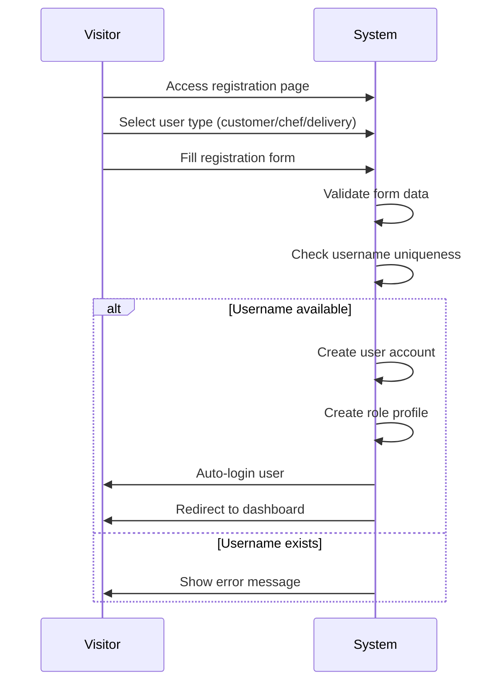

## UC-002: User Login
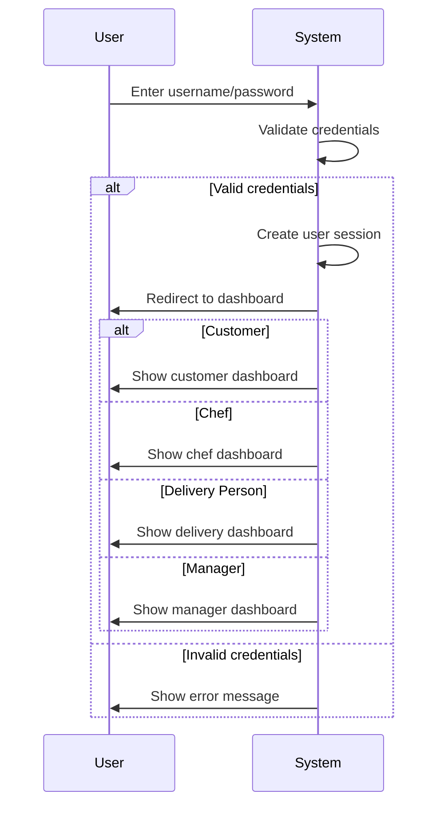

## UC-004: Browse Menu
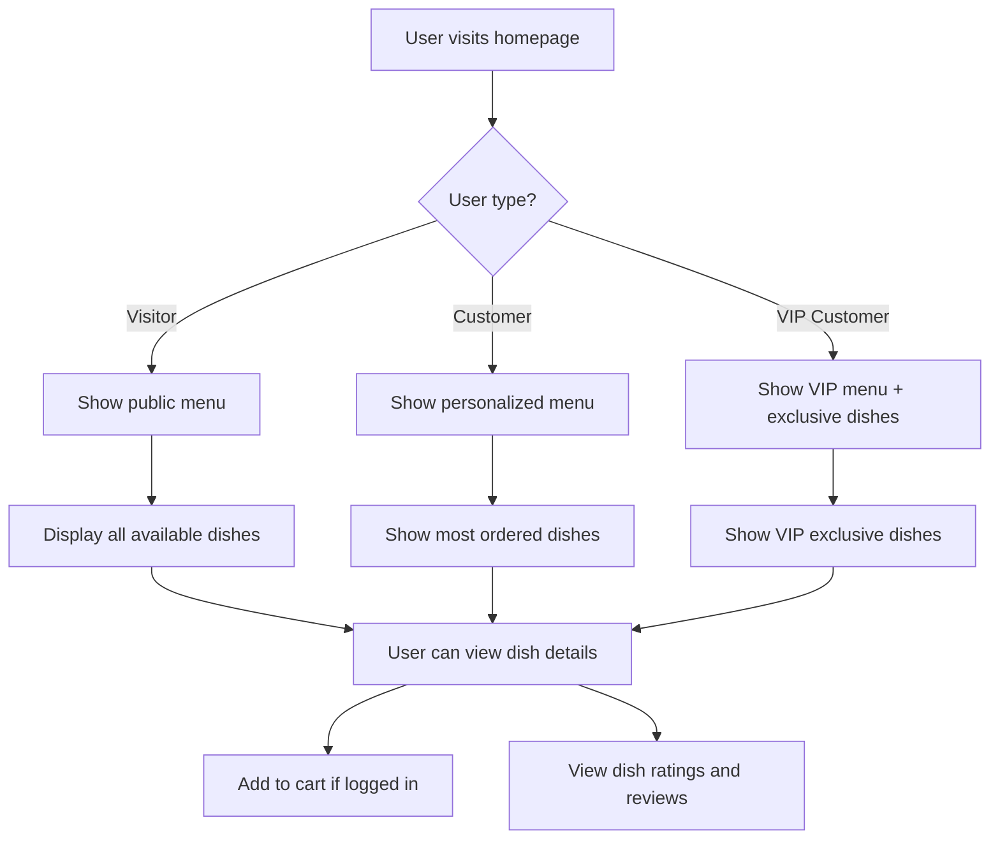

## UC-007: Add Item to Cart
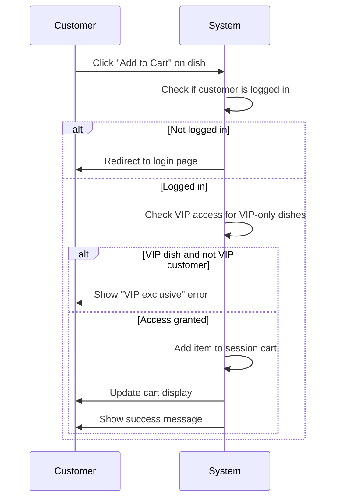

## UC-008: Create Order
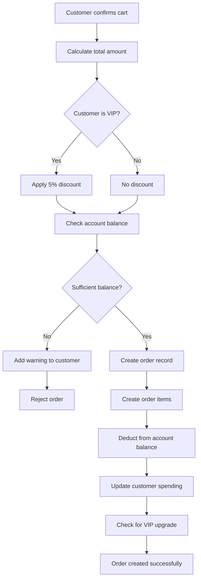

## UC-010: Delivery Person Bidding
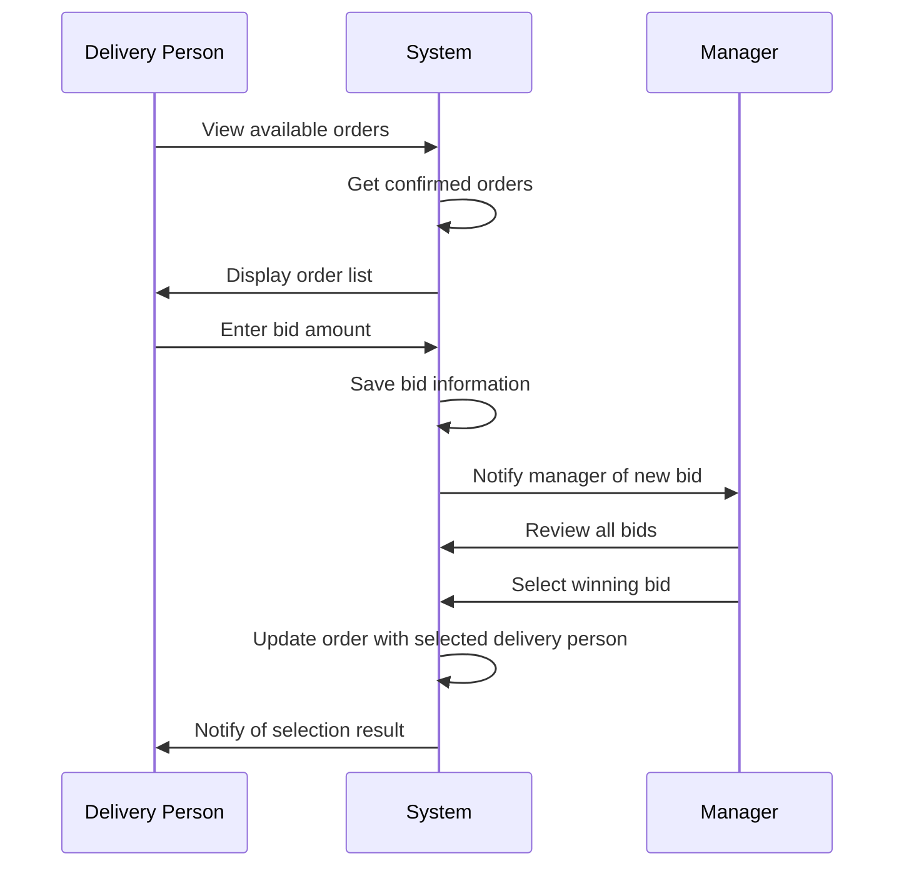

## UC-011: Delivery Route Planning
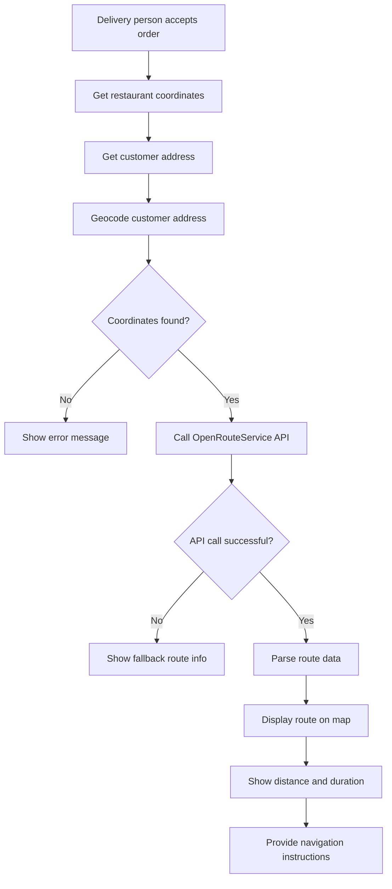

## UC-013: AI Intelligent Q&A
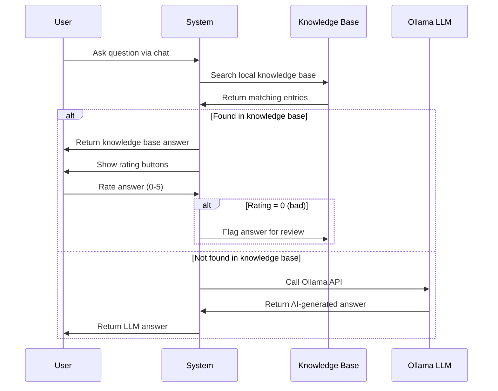

## UC-015: Submit Complaint
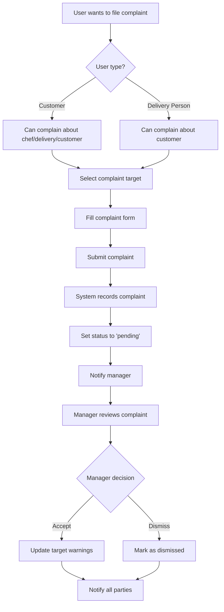

## UC-018: VIP Status Check
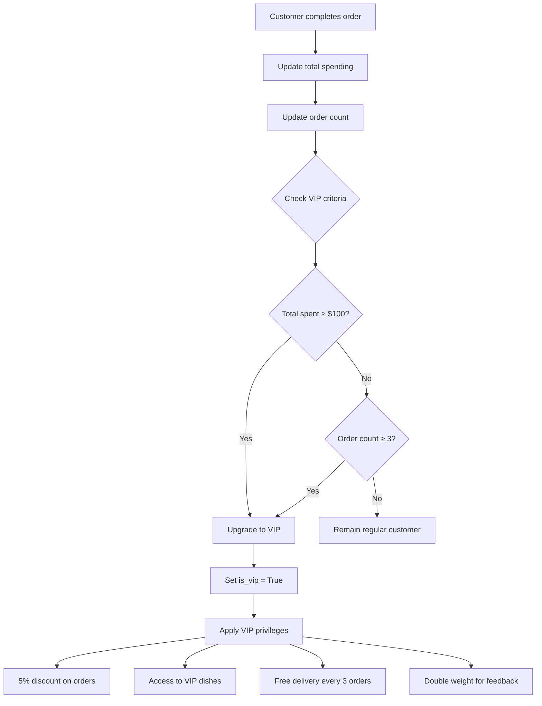

## UC-020: Account Top-up
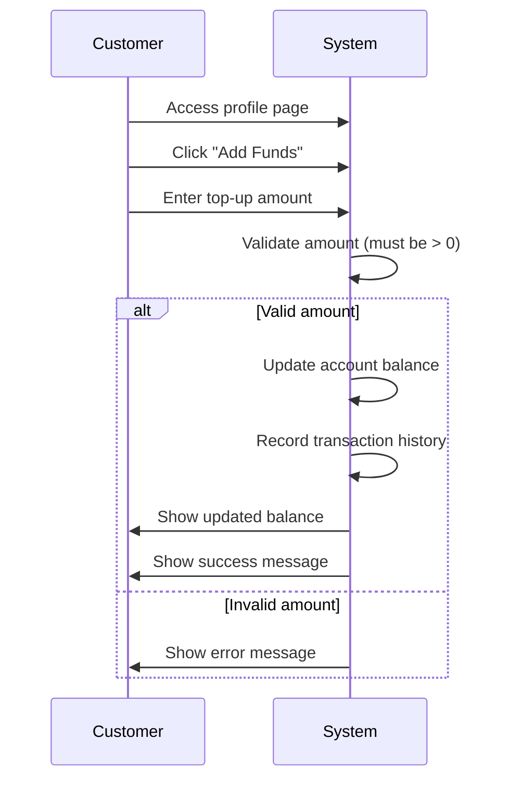

## UC-021: Payment Verification
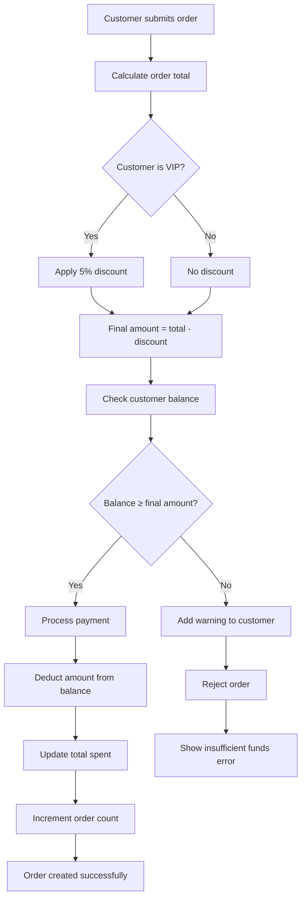

---

## How to Use These Diagrams

### Option 1: Mermaid Live Editor
1. Go to https://mermaid.live/
2. Copy any of the diagram codes above
3. Paste into the editor
4. Export as PNG/SVG

### Option 2: GitHub
1. Create a new .md file on GitHub
2. Paste the diagram code
3. GitHub will automatically render the diagrams
4. Right-click to save as image

### Option 3: VS Code
1. Install Mermaid Preview extension
2. Open the .md file
3. Use preview mode to see diagrams
4. Export as needed

### Option 4: Professional Tools
Use the flowchart descriptions to create diagrams in:
- Lucidchart
- Draw.io
- Visio
- Figma
